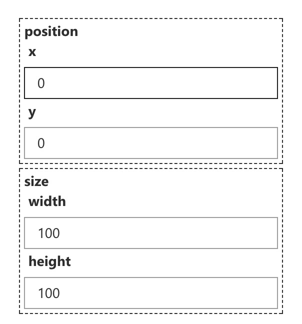
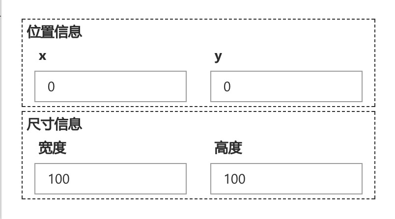
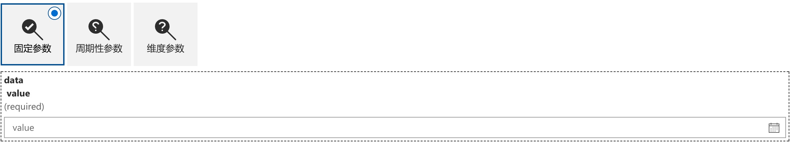
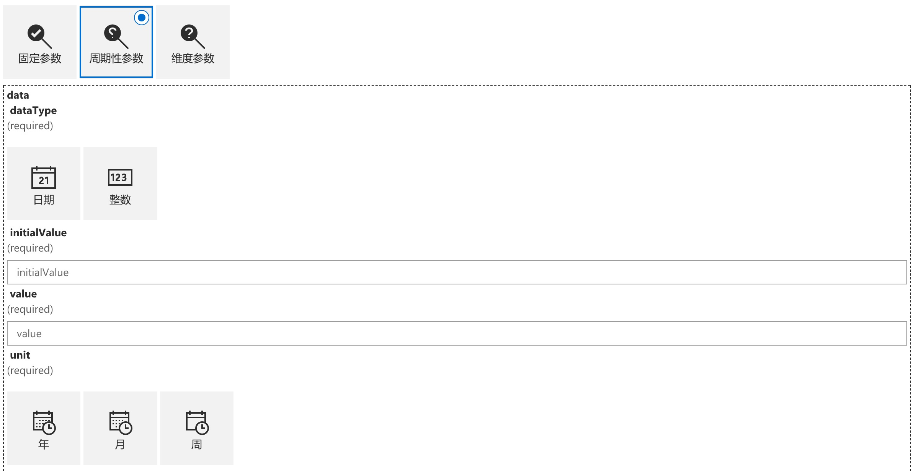
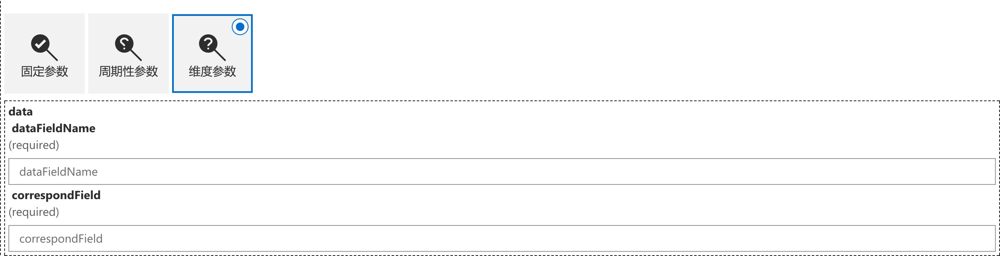
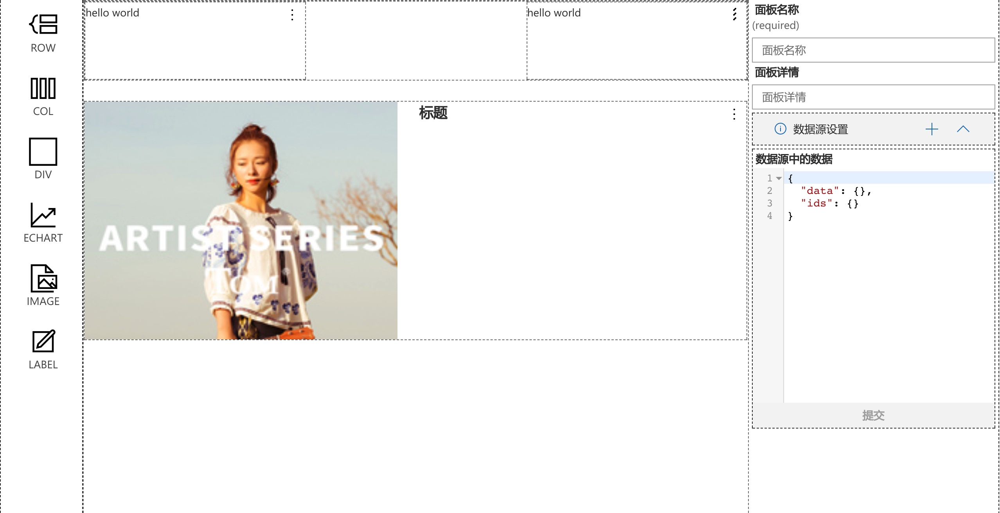

# react-schema-form

爬虫前端核心组件。

# react-schema-form-react

通过[json-schema](http://jsonschema.net/),[ui-schema](#custoization-ui-schema),自动生成表单组件。前后端可以复用一份JsonSchema来验证字段，错误消息前后端统一，这个可以有。


[一个完整的栗子](https://nick121212.github.io/fx-schema-form-react-demo/dist/index.html#/panel/create)

[点击这里查看demo](https://nick121212.github.io/fx-schema-form/packages/fx-schema-form-react/out/index.html)

> Note: 组件之间的功能组合使用hoc来实现。

## 目录

- [安装](#installation)
    - [npm](#installation-npm)
    - [cdn](#installation-cdn)
- [依赖项](#dependencies)
- [默认使用](#usage)
- [表单定制化](#custoization)
    - [uiSchema配置](#custoization-ui-schema)
    - [供选择的表单组件](#custoization-widget)
        - [input](#custoization-widget-input)
        - [select](#custoization-widget-select)
        - [number](#custoization-widget-number)
        - [redio](#custoization-widget-redio)
    - [模板](#custoization-temps)
    - [HOCS](#custoization-hocs)
    - [字段](#custoization-fields)
- [高级配置](#advanced-customization)
    - [自定义hoc](#advanced-customization-hoc)
    - [自定义字段](#advanced-customization-field)
    - [自定义模板](#advanced-customization-temp)
    - [自定义组件](#advanced-customization-widget)
- [验证](#validation)
    - [本地验证](validation-local)
    - [远程验证](validation-remote)
- [关于JsonSchema](#about-json-schema)
- [License](#license)

## <span id="installation">安装</span>

Requires React 15.0.0+.
> Note: 当前使用*tsc -d*来编译，代码为es6代码;
>

### <span id="installation-npm">通过npm来安装</span>

``` 
$ npm install fx-schema-form-react --save
```
> Note: 当前组件库默认使用了antd的样式，你也可以使用其他样式来代替。

### <span id="installation-cdn">cdn</span>

> Note: 暂时没有cdn。

## <span id="dependencies">依赖项</span>

- JsonSchema
- antd
- redux
- higher order component
- react-redux
- recompose
- react-act
- immutable
- avj
- json-pointer

## <span id="usage">默认使用</span>

```jsx
// 全局的参数设定
const globalOptions = {
    "boolean": {
        "widget": "switch"
    },
    "hoc": {
        "array": {
            "ItemChildButtons": ItemChildButtons, // 数组field下子元素的操作按钮，删除，移位等
            "ItemButtons": ItemButtons // 数组field的根的操作，新建等
        }
    },
    "widget": {},
    "field": {
        "string": {
            "ui:temp": ["formItem"]
        },
        "boolean": {
            "ui:temp": ["formItem"]
        },
        "number": {
            "ui:temp": ["formItem"]
        },
        "object": {
            "ui:temp": ["card"],
            "root": ({ children }) => children
        },
        "array": {
            "ui:temp": ["card"],
            "root": ({ children }) => children
        },
        "design": {
            "root": ({ children }) => children
        }
    }
};
```

``` jsx

/* 定义一个schemaFormModel，这里会产生2个属性；1：actions,2:reducer
** 模式支持：1：immu；2：jpp
** ajv: 全局的ajv实例
** schema jsonschema
*/
const schemaFormModel: FormReducer<any> = createForms.createOne("firstForm",    Immutable.formJS({}), {
    reducerKeys: []
}, "immu", ajv, schema);

```

``` jsx
// 渲染组件实例
<SchemaForm schemaKey={"firstForm"}
    schemaFormOptions={{ajv:ajv}} // 这里传入ajv参数
    schema={schema}
    reducerKeys={reducerKeys} // 这里是reducer的路径数组
    RootComponent={({ children }) => children} // 包裹的根元素，这里使用了react 16+，直接返回children
    uiSchema={uiSchema}
    globalOptions={globalOptions}>
</SchemaForm>
```

## <span id="custoization">表单定制化</span>

> Note: JsonSchema用于定义数据结构以及验证规则;
> 而表单的展现形式需要手动配置；

### <span id="custoization-ui-schema">uiSchema配置</span>


JsonSchema
``` jsx
const schema = {
    type: "object",
    properties: {
        position: {
            type: "object",
            properties: {
                x: { type: "number" },
                y: { type: "number" }
            }
        },
        size: {
            type: "object",
            properties: {
                width: { type: "number" },
                height: { type: "number" }
            }
        }
    }
};
```

> 这里使用默认的uiSchema
```jsx
let uiSchema=["*"];
```




> 这里我们对uiSchema做美化

``` jsx
let uiSchema = [{
    key: ["data", "position"].join("/"),
    field: "object",
    title: "位置信息",
    "ui:temp": ["card", "row"],
    items: [{
        key: ["data", "position", "x"].join("/"),
        title: "x",
        "ui:temp": ["col", "formItem"],
    }, {
        key: ["data", "position", "y"].join("/"),
        title: "y",
        "ui:temp": ["col", "formItem"],
    }]
}, {
    key: ["data", "size"].join("/"),
    field: "object",
    title: "尺寸信息",
    "ui:temp": ["card", "row"],
    items: [{
        key: ["data", "size", "width"].join("/"),
        title: "宽度",
        "ui:temp": ["col", "formItem"],
    }, {
        key: ["data", "size", "height"].join("/"),
        title: "高度",
        "ui:temp": ["col", "formItem"],
        options:{
            // 这个是设置col这个template的参数
            col:{
                className:"ma0 pa0"
            },
            // 这里是组件参数
            widget:{
                // 这里的schema类型是number，所以默认对应的是number这个widget，这里可以设置number组件的参数
                number:{
                    onChanged:(val:string)=>{
                        console.log(val);
                    }
                }
            }
        }
    }]
}]
```



- 默认字段
    - key:string            用于确定是哪个字段，格式为 */*形式(例如: name; array1/-/test)，这里的\-代表数组的索引;
    - title:string          当前组件的说明文字
    - field:string          用于自定义field组件
    - theme:string          用于自定义的样式
    - widget:string         用于自定义组件
    - items:Array           用于显示子元素
    - ui:temp:Array         用于定义模板
    - ui:item.hoc:Array     用于自定义hoc
    - options:Object        设置项
        - hoc:Object        设置hoc的参数项
        - widget:{[key]:Object}     设置widget的参数，这里的key需要替换成具体的widget的名称
        - temp:Object       设置模板的配置参数，这里的temp需要替换成具体的temp的名称，可以有多个

> Note: 如果key直接设置成string类型，自动转换成{key:string}格式。


## <span id="custoization-widget">供选择的表单组件</span>

widget字段最终的展现形式。一个字段一般可以由多个widget来表现。比如一个string字段，可以使用text，textarea，select，radio等来表现，这个取决于个人喜好。

> Note: 组件可以自行添加。
### <span id="custoization-widget-input">input</span>
用于显示文本的组件
### <span id="custoization-widget-select">select</span>
用于下拉展示的组件
### <span id="custoization-widget-number">number</span>
用于显示数字的组件
### <span id="custoization-widget-redio">redio</span>
用户展示单选组的组件
## <span id="custoization-temps">模板</span>
模板是包装widget的组件，可以使用多个模板来包装。

- 默认模板
    - card      antd中的Card组件
    - col       antd中的col组件
    - formitem  antd中的FormItem组件
    - row       antd中的Row组件

> Note: 模板之间的组合取决于样式库的组件，比如antd中，默认使用FormItem来包装widget。当然也可以使用Card，Row，Col等容器组件。这里FormItem包装了错误信息的显示，你也可以自定一个组件来显示错误信息。数组类型的字段使用默认使用三个模板["row", "col", "card"]
## <span id="custoization-hocs">HOCS</span>

[HOC](https://gist.github.com/sebmarkbage/ef0bf1f338a7182b6775)用于包装组件，相当于一个装饰器模式；

### 默认的hoc

- utils     一些工具方法
``` tsx
export interface UtilsHocOutProps {
    // 返回一个hoc的参数，这里会合并全局参数，以及uiSchema设置的参数
    getHocOptions: (hoc?: string) => any;
    // 返回一个field的参数，这里会合并全局参数，以及uiSchema设置的参数
    getFieldOptions: (field: string) => any;
    // 返回一个widget的参数，这里会合并全局参数，以及uiSchema设置的参数
    getWidgetOptions: (widget: string) => any;
    // 返回一个temp的参数，这里会合并全局参数，以及uiSchema设置的参数
    getTempOptions: (temp: string) => any;
    // 返回当前组件的title；uiSchema.title || title || key
    getTitle(): () => any;
    // 根据相对路径，计算得到一个新的keys
    // keys:["a","b"] path:"./c" return ["a","c"]
    getPathKeys: (keys: string[], path: string) => string[];
}
```

- merge     用于合并JsonSchema和UiSchema。
``` tsx
export interface MergeHocOutProps {
    // 属性中传入，这里添加了map对象
    schemaFormOptions: any;
    // 合并schema和uiSchema后的数据
    mergeSchemaList: any;
    // 通过ajv计算得到的默认数据
    formDefaultData?: any;
}
```
- make      用于包装hoc的hoc；这里获取uiSchema中ui:item.hoc:Array字段的值，来动态包装hoc。
- array     用于处理数组类型的hoc。
``` jsx
export interface ArrayHocOutProps extends SchemaFormItemBaseProps, ValidateHocOutProps, MakeHocOutProps {
    // 隐藏显示组件
    toggleItem?: () => void;
    // 删除一个数据
    removeItem?: (index: number) => void;
    // 添加一个数据
    addItem?: (data?: any) => void;
    // 元素交换位置
    switchItem?: (curIndex: number, switchIndex: number) => void;
    // 包含一个操作Component，用于添加，显示/隐藏
    ItemButtons?: new () => React.PureComponent<any>;
    // 每个子元素包含的Component 用户删除，交换位置使用
    ItemChildButtons?: new () => React.PureComponent<any>;
}
```
- field     用于判断当前字段的Field组件和Widget组件。
```jsx
export interface FieldHocOutProps {
    // field字段所对应的组件
    FieldComponent: RC<any, any>;
    // widget字段所对应的组件
    WidgetComponent: RC<any, any>;
}
```
- temp      用于创建模板的hoc，使用UiSchema中的ui:temp字段。
- theme     用于调用当前使用的样式，使用UiSchema中的theme字段。
```jsx
export interface ThemeHocOutProps {
    // 当前所对应的theme工厂类
    currentTheme: NsFactory;
}
```
- validate  用于验证字段的合法性，传递validate方法到组件。
```jsx
export interface ValidateHocOutProps {
    // 验证方法，返回验证的结果
    validate?: (data: any) => Promise<any>;
    // 更新一个当前元素的值
    updateItemData?: (data: any, meta?: any) => void;
    // 更新当前元素的meta信息
    updateItemMeta?: (data: any) => void;
}
```

> Note: SchemaFormItem中使用make来动态包装Hoc;这里的Hoc顺序：ThemeHoc -> FieldHoc -> ValidateHoc -> ArrayHoc -> TempHoc；这个顺序不能改变，但是每个hoc之间可以插入新的hoc。
arrayHoc做了A/B Test，如果是数组才使用，其他类型直接返回Component。

## <span id="custoization-fields">字段</span>

字段组件用于确定如何来显示子组件。可以同时设置uiSchema中的field值来指定。默认使用JsonSchema中的type来确定使用的字段类型。

- 默认字段
    - array     显示数组类型的字段；遍历数组元素，嵌套一层SchemaForm，并且传递arrayIndex数组索引字段。
    - normal    显示普通类型的字段；直接展示widget组件
    - object    显示对象类型的字段；嵌套一层SchemaForm

> Note: 可以定义自定义字段来解析不同的数据结构；[一个树形结构的解析栗子](https://nick121212.github.io/fx-schema-form-react-demo/dist/index.html#/panel/create)

## <span id="advanced-customization">高级配置</span>

### <span id="advanced-customization-hoc">自定义hoc</span>

如果默认的hoc功能不够用，可以自定义hoc来扩展SchemaFormItem组件。
比如需要一个根据某个字段的值，开显示不同的表单。

```jsx

import React from "react";
import { compose, shouldUpdate, ComponentEnhancer } from "recompose";
import { connect } from "react-redux";
import Jsonata from "jsonata";
import Immutable from "immutable";

import { SchemaFormItemBaseProps, RC, ThemeHocOutProps, ValidateHocOutProps, conFactory } from "fx-schema-form-react";
import { mapFormItemDataProps, mapMetaStateToProps, mapFormDataToProps } from "fx-schema-form-react/libs/hocs/select";
import { BaseFactory } from "fx-schema-form-core";
import { UtilsHocOutProps } from "fx-schema-form-react/libs/hocs/item/utils";
import { createSelector } from "reselect";

export interface ConditionHocOutProps extends SchemaFormItemBaseProps, ThemeHocOutProps, UtilsHocOutProps {
    condition?: Immutable.Map<string, any>;
}

export interface ConditionPath {
    path: string;
    jsonata?: string;
}

export interface ConditionHocOutSettings {
    paths?: ConditionPath[];
    hoc?: ComponentEnhancer<any, any>;
}

/**
 * condition
 * 筛选出需要使用的字段，包装到condition这个prop中，传递到下层组件
 * 配置：
 *  paths：字段的路径以及数据处理规则，路径使用相对或者决定路径
 *  hoc：   下层的包装组件
 * @param hocFactory  hoc的工厂方法
 * @param Component 需要包装的组件
 */
export default (hocFactory: BaseFactory<any>, settings: ConditionHocOutSettings = { paths: [] }) => {
    let defaultCON = conFactory.get("default");
    return (Component: any): RC<ConditionHocOutProps, any> => {
        @(shouldUpdate(() => false) as any)
        class ComponentHoc extends React.Component<ConditionHocOutProps, any> {
            public render(): JSX.Element {
                const { getPathKeys, mergeSchema } = this.props;
                const { paths, hoc } = settings;
                const { keys } = mergeSchema;
                let ComponentWithHoc = Component;

                if (paths && paths.length && hoc) {
                    /**
                     * 从state中获取所有的数据
                     * 根据配置来筛选出配置中的字段
                     */
                    let con = createSelector([defaultCON.getAllData.bind(defaultCON)], (formData: any) => {
                        let rtns: Immutable.Map<string, any> = Immutable.fromJS({});

                        paths.forEach((path: ConditionPath) => {
                            let keys1 = getPathKeys(keys, path.path);
                            let val = formData.getIn(keys1);
                            let exp = Jsonata(path.jsonata || "$$");

                            try {
                                rtns = rtns.setIn(keys1, exp.evaluate(val));
                            } catch (e) {
                                console.log(e);
                            }
                        });

                        return {
                            condition: rtns
                        };
                    });

                    ComponentWithHoc = compose(connect(con), hoc)(Component);
                }

                return <ComponentWithHoc {...this.props} />;
            }
        }

        return ComponentHoc as any;
    };
};

hocFactory.add("con",ConditionHoc);

```

``` jsx


import React from "react";
import { onlyUpdateForKeys } from "recompose";
import Immutable from "immutable";
import { SchemaFormItemBaseProps, RC, UtilsHocOutProps } from "fx-schema-form-react";
import { BaseFactory } from "fx-schema-form-core";
import { ConditionHocOutProps } from "./condition";
import { BaseComponent } from "../../component/index";

export interface Props extends SchemaFormItemBaseProps, UtilsHocOutProps, ConditionHocOutProps {
}

export interface Settings {
    path: string;
    jsonata?: string;
    uiSchemas?: any[];
}

/**
 * oneof装饰器
 * 这里解析一种特殊的schema字段oneof
 * {
 *  "name":{
 *      "oneof":[{"type":"string"},{"type":"number"}]
 *  }
 * }
 * 必须接口conditionHoc使用
 * @param hocFactory  hoc的工厂方法
 * @param Component 需要包装的组件
 */
export default (hocFactory: BaseFactory<any>, settings: Props = { path: "", jsonata: "" }) => {
    return (Component: any): RC<Props, any> => {
        @(onlyUpdateForKeys(["condition"]) as any)
        class ComponentHoc extends BaseComponent<Props, any> {
            public render(): JSX.Element {
                let { getPathKeys, mergeSchema, condition } = this.props;
                const { path = null, jsonata = null, uiSchemas = {} } = settings || {};
                const { keys } = mergeSchema;

                if (!path) {
                    return <Component {...this.props} />;
                }

                let keys1 = getPathKeys(keys, path);
                let data = condition.getIn(keys1);

                if (mergeSchema.oneOf && uiSchemas[data]) {
                    let { index, uiSchema } = uiSchemas[data];

                    let mergeNewSchema = Object.assign({

                    }, this.props.mergeSchema, mergeSchema.oneOf[index], {
                            keys: keys
                        });

                    mergeNewSchema.uiSchema.items = uiSchema;

                    return <Component {...this.props} mergeSchema={mergeNewSchema} />;
                }

                return <Component {...this.props} />;
            }
        }

        return ComponentHoc as any;
    };
};

hocFactory.add("oneOf",ConditionHoc);
```

Schema

``` jsx
let schema = {
    oneOf: [{
        default: {},
        type: "object",
        title: "固定参数-fixed",
        required: ["value"],
        properties: {
            value: { type: "string" }
        }
    }, {
        type: "object",
        default: {},
        title: "维度参数-dimension",
        required: ["dataFieldName", "correspondField"],
        properties: {
            dataFieldName: { type: "string" },
            correspondField: { type: "string" }
        }
    }, {
        type: "object",
        default: {},
        title: "周期性参数-period",
        required: ["correspondValue"],
        properties: {
            correspondValue: {
                default: {},
                type: "object",
                required: ["dataType", "initialValue", "periodGap"],
                properties: {
                    dataType: { type: "string" },
                    initialValue: { type: "string" },
                    periodGap: {
                        type: "object",
                        required: ["value", "unit"],
                        properties: {
                            value: { type: "number" },
                            unit: { type: "string" }
                        }
                    }
                }
            }
        }
    }]
}
```

设置uiScham的值，根据不同的【type】的值，来显示不同的表单；

``` jsx
[{
    key: "data",
    "ui:item.hoc": ["theme", "field", "validate", "temp", hocFactory.get("con")({
        paths: [{ path: "./type", jsonata: "$" }],
        hoc: hocFactory.get("oneof")({
            path: "./type",
            uiSchemas: {
                "fixed": {
                    index: 0,
                    uiSchema: [{
                        key: "data/value",
                        widget: "combobox",
                        "ui:item.hoc": ["theme", "field", "validate", "temp", "proxy"],
                        options: {
                            hoc: {
                                proxy: {
                                    property: "options",
                                }
                            },
                            widget: {
                                combobox: {
                                    autoComplete: "on",
                                    allowFreeform: true
                                }
                            }
                        }
                    }]
                },
                "dimension": {
                    index: 1,
                    uiSchema: ["*"]
                },
                "period": {
                    index: 2,
                    uiSchema: [{
                        key: "data/correspondValue/dataType",
                        widget: "choice",
                        options: {
                            widget: {
                                choice: {
                                    options: [{
                                        key: "date",
                                        iconProps: { iconName: "EventDate" },
                                        text: "日期"
                                    }, {
                                        key: "integer",
                                        iconProps: { iconName: "NumberField" },
                                        text: "整数"
                                    }]
                                }
                            }
                        }
                    }, {
                        key: "data/correspondValue/initialValue",
                        widget: "text",
                        "ui:item.hoc": ["theme", "field", "validate", "temp", hocFactory.get("con")({
                            paths: [{ path: "./dataType", jsonata: "$" }],
                            hoc: hocFactory.get("custom")({
                                path: "./dataType", func: (props, data) => {
                                    if (data === "date") {
                                        props.mergeSchema.uiSchema.widget = "date";
                                    } else if (data === "integer") {
                                        props.mergeSchema.uiSchema.widget = "text";
                                    }
                                }
                            })
                        }), "field"]
                    }, {
                        key: "data/correspondValue/periodGap/value",
                    }, {
                        key: "data/correspondValue/periodGap/unit",
                        widget: "choice",
                        options: {
                            widget: {
                                choice: {
                                    options: [{
                                        key: "year",
                                        iconProps: { iconName: "DateTime" },
                                        text: "年"
                                    }, {
                                        key: "month",
                                        iconProps: { iconName: "DateTimeMirrored" },
                                        text: "月"
                                    }, {
                                        key: "week",
                                        iconProps: { iconName: "DateTime2" },
                                        text: "周"
                                    }]
                                }
                            }
                        }
                    }]
                }
            }
        })
    }), hocFactory.get("con")({
        paths: [{ path: "./", jsonata: "$" }],
        hoc: hocFactory.get("custom")({
            path: "./",
            func: (props: any, data) => {
                data = data.toJS();
                if (data.type === "fixed") {
                    props.mergeSchema.uiSchema.items[0].widget = data.widget;
                }
            }
        })
    })],
    "ui:temp": "card",
    field: "object",
    items: [],
}]
}]
}];
```






### <span id="advanced-customization-field">自定义字段</span>

> NOTE: 自定义字段用于解析特殊的数据格式

这里是一个树形结构，这里是希望做成一个可以拖拽的编辑页面，所以不能直接像普通的数组一样渲染组件。下图中，中间和右边部分都是一个SchemaForm组件。


[DEMO](https://nick121212.github.io/fx-schema-form-react-demo/dist/index.html#/panel/create)

``` jsx
 let schema= {
    type: "object",
    $id: "design",
    properties: {
        infoOptions: {
            type: "array",
            items: {
                type: "object",
                properties: {
                    data: {
                        oneOf: [{
                            type: "object",
                            properties: {}
                        }, {
                            type: "string"
                        }]
                    },
                    infoOptions: {
                        $ref: "design#/properties/infoOptions"
                    }
                }
            }
        }
    }
};
```

``` jsx
import React from "react";
import { connect } from "react-redux";
import { nsFactory, SchemaForm, SchemaFormItemProps, RC, hocFactory } from "fx-schema-form-react";
import { mapFormItemDataProps } from "fx-schema-form-react/libs/hocs/select";
import { compose, shouldUpdate } from "recompose";
import { ExtraFieldHocOutProps } from "../hocs/field";
import { globalOptions as globalAllOptions } from "../index";

export interface DesignFieldProps extends SchemaFormItemProps, ExtraFieldHocOutProps {

}

/**
 * 数组字段的生成规则
 * 用于
 */
@(shouldUpdate(() => false) as any)
@(compose(connect(mapFormItemDataProps)) as any)
export class DesignField extends React.PureComponent<DesignFieldProps, any> {
    /**
     * 遍历数据，生成子表单
     * @param idx 数组的索引
     */
    private renderItem(idx: number): JSX.Element {
        const { mergeSchema, schemaKey, globalOptions, schemaFormOptions,
            getCurrentState, ItemChildButtons, arrayLevel = [], arrayIndex, currentTheme, formItemData,
            getFieldOptions, reducerKeys } = this.props;
        const { uiSchema, keys } = mergeSchema;
        const { data = {} } = formItemData;

        delete mergeSchema.uiSchema;

        return (
            <SchemaForm
                key={keys.concat([idx]).join("/")}
                arrayIndex={idx}
                schemaFormOptions={schemaFormOptions}
                schemaKey={schemaKey}
                reducerKeys={reducerKeys}
                arrayLevel={arrayLevel.concat([idx])}
                schema={Object.assign({}, mergeSchema)}
                parentKeys={mergeSchema.originKeys}
                RootComponent={({ children }) => {
                    return children;
                }}
                uiSchema={[{ key: mergeSchema.originKeys.concat(["infoOptions/-"]).join("/") }]}
                globalOptions={globalOptions}>
            </SchemaForm>
        );
    }

    /**
     * 渲染页面
     */
    public render(): any {
        const { children, formItemData, getFormItemData, arrayLevel, reducerKeys, getFieldOptions,
            currentTheme, mergeSchema, arrayIndex, schemaFormOptions, schemaKey, globalOptions } = this.props;
        let child = formItemData && formItemData.get("infoOptions")
            && formItemData.get("infoOptions").map((d: any, idx: number) => {
                return this.renderItem(idx);
            });
        let options = getFormItemData.call(this);

        if (options.uiSchema && options.uiSchema.widget) {
            if (currentTheme.widgetFactory.has(options.uiSchema.widget)) {
                let WidgetComponent = currentTheme.widgetFactory.get(options.uiSchema.widget);

                return [
                    <SchemaForm
                        key={mergeSchema.keys.concat(["data"]).join("widget")}
                        arrayIndex={arrayIndex}
                        schemaFormOptions={schemaFormOptions}
                        schemaKey={schemaKey}
                        arrayLevel={arrayLevel}
                        reducerKeys={reducerKeys}
                        schema={mergeSchema}
                        parentKeys={mergeSchema.originKeys}
                        RootComponent={getFieldOptions("design").root}
                        uiSchema={[{
                            key: mergeSchema.originKeys.concat(["data"]).join("/"),
                            field: "string",
                            widget: options.uiSchema.widget
                        }]}
                        globalOptions={globalOptions}>
                    </SchemaForm>
                ];
            }
        }

        return [children, child || null, dataComponent];
    }
}

```

### <span id="advanced-customization-temp">自定义模板</span>

这里是一个可以resize和drog的div容器，这个是上面栗子中的一个组件。

```jsx
import React from "react";
import classNames from "classnames";
import { SchemaFormItemProps } from "fx-schema-form-react";
import Rnd from "react-rnd";
import { connect } from "react-redux";
import { mapFormItemDataProps } from "fx-schema-form-react/libs/hocs/select";

export interface DivTempProps extends SchemaFormItemProps {
    tempKey: string;
    actions: any;
}

@connect(mapFormItemDataProps)
export class RndTemp extends React.Component<DivTempProps, any> {
    public render(): JSX.Element {
        const { children, globalOptions, actions, tempKey, uiSchemaOptions, mergeSchema, getTempOptions } = this.props;
        const { className, ...tempOptions } = getTempOptions.call(this, tempKey);

        return <Rnd
            style={{
                zIndex: 1000,
                position: "absolute"
            }}
            {...tempOptions}
            bounds="parent"
            className={classNames("rnd", className)}
            default={{
                x: 0,
                y: 0
            }}
            onResize={(e, direction, ref, delta, position) => {
                actions.updateItem({
                    keys: mergeSchema.keys.concat(["data"]),
                    data: {
                        size: {
                            width: ref.offsetWidth,
                            height: ref.offsetHeight
                        },
                        position
                    }
                });
            }}
            onDragStop={(e: any, data: any) => {
                actions.updateItem({
                    keys: mergeSchema.keys.concat(["data", "position"]),
                    data: {
                        x: data.x,
                        y: data.y
                    }
                });
            }}>
            {children}
        </Rnd>;
    }
}

```

模板用于提供额外的显示组件，比如验证错误信息，loading信息等等。

### <span id="advanced-customization-widget">自定义组件</span>

这里是一个input的组件

```jsx
import React, { SyntheticEvent } from "react";
import { SchemaFormItemProps } from "fx-schema-form-react";

import { TextField } from "office-ui-fabric-react/lib/TextField";

export interface TextBoxWidgetProps extends SchemaFormItemProps {
}

export class TextBoxWidget extends React.PureComponent<TextBoxWidgetProps, any> {
    public render(): JSX.Element {
        const { mergeSchema, globalOptions, uiSchemaOptions, updateItemMeta,
            updateItemData, formItemData, getTitle, getWidgetOptions } = this.props;
        const { uiSchema = {}, keys } = mergeSchema;
        const widgetOptions = getWidgetOptions("text");

        return <TextField
            onChanged={(val: string) => {
                updateItemData(val);
            }}
            onBlur={(e: any) => {
                updateItemMeta(e.target.value);
            }}
            placeholder={getTitle()}
            {...widgetOptions}
            {...this.setDefaultProps() }
        />;
    }

    private setDefaultProps(): any {
        const { mergeSchema } = this.props;
        const props: any = {};

        if (this.props.formItemData !== undefined) {
            props.value = this.props.formItemData;
        } else {
            props.value = "";
        }

        return props;
    }
}
```

显示组件，比如input，autocomponent等。

## <span id="license">License</span>

Apache 2