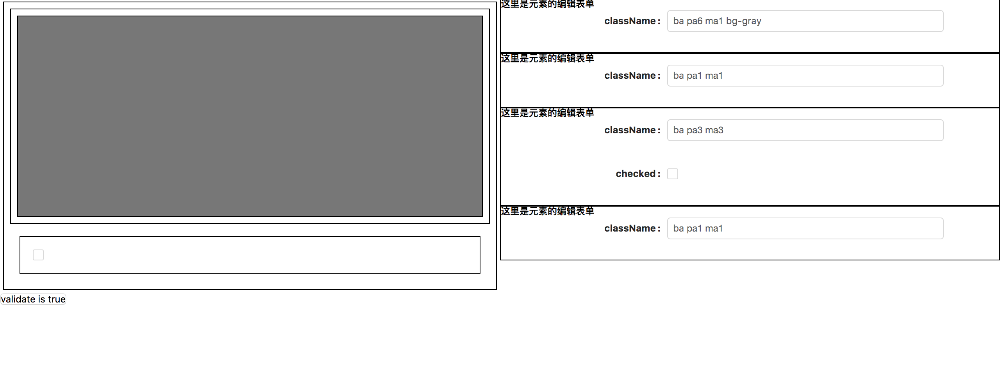
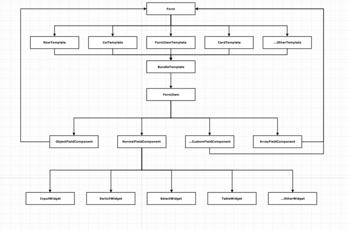
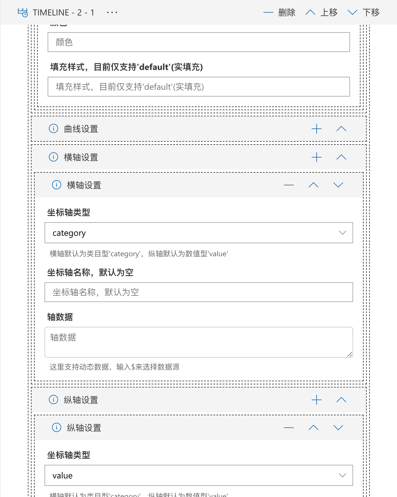

# react-schema-form [](https://travis-ci.org/nick121212/fx-schema-form)

爬虫前端核心组件。用于生成静态或者动态表单；

## 一个一直有想法但并没有花时间去实现的功能



>举个栗子：

有一份数据结构：

```json
{
    "style":{
        "width": 100,
        "height": 100,
    },
    "className": "ba bb-dashed"
}
```

如果用表单来生成数据，只需要3个文本框搞定；
如果数据应用到div上，会呈现出一个带虚线框高度和宽度都是100的div；或者说这个数据应用到任何不是内敛元素的元素上都会给元素添加边框和高宽；
那我是不是可以左边表单，右边div，这样可以查看实时的渲染效果，假设数据是实时变化的话。

那么问题来了：当我渲染的不是div，而是一个复杂的组件，可能有几十个属性，而且随着组件版本的升级，属性也要做相应的变更，有些属性需要使用动态数据（接口回来的数据不能直接用，要经过简单处理）咋玩？咋玩？咋玩？

我的想法：

- 希望表单是动态的，可以让我通过简单的配置来生成，最好有一个动态表单引擎。可以支持复杂的数据结构，数据的联动，包括ajax的数据拉取，条件控制，验证等等功能。
- 希望数据的更改是实时的更新的，因为很多的组件依赖于同一份数据。只要一边发生变化，其他的组件也能发生改变，所见即所得；

基于这样的一些问题，开始组件的选型：

- 好吧，公司使用react。（虽然我是angular阵营）
- redux来实现数据的实时更新。（可以做编辑器了）
- immutable来做不可变数据。（插件系统，数据的层层传递，可不能让中间某个家伙破坏数据）
- ajv来做数据验证。（官网说是性能最强的jsonschema验证组件）
- github上有成千上万的hoc组件。（用hoc来做插件系统）

于是就有了：



SchemaForm的难点在于

- 数据结构的复杂程度。
- 解决JsonSchema和UiSchema之间的关联。因为JsonSchema是可以互相嵌套的。以及各种关键字。比如anyOf,oneOf,allOf等。
- 各种组件之间高内聚低耦合。
- 灵活性和性能。
- 动态数据，比如echart中的[data]字段，如果需要从接口获取; 如果通过配置，data的数据格式会出现二义性（data是数组类型，而配置的可能是字符串）；如果data数据需要多个接口的数据简单合并呢？



再来看看下面的数据结构（相信你会疯掉）：

逻辑复杂，条件判断繁琐，验证困难；但这就是SchemaForm的使用场景。

```json
{
    "type": "object",
    "required": [
        "name",
        "type",
        "dsOption"
    ],
    "properties": {
        "name": {
            "type": "string",
            "minLength": 2
        },
        "type": {
            "type": "string"
        },
        "dsOption": {
            "type": "object",
            "required": [
                "sourceType"
            ],
            "default": {},
            "properties": {
                "menuId": {
                    "type": "number"
                },
                "parentMenuId": {
                    "type": "number"
                },
                "params": {
                    "type": "array",
                    "default": [],
                    "items": {
                        "type": "object",
                        "required": [
                            "name",
                            "type",
                            "data"
                        ],
                        "properties": {
                            "name": {
                                "type": "string"
                            },
                            "type": {
                                "type": "string",
                                "enum": [
                                    "period",
                                    "dimension",
                                    "fixed"
                                ]
                            },
                            "data": {
                                "oneOf": [{
                                    "default": {},
                                    "type": "object",
                                    "title": "固定参数-fixed",
                                    "required": [
                                        "value"
                                    ],
                                    "properties": {
                                        "value": {
                                            "type": "string"
                                        }
                                    }
                                }, {
                                    "type": "object",
                                    "default": {},
                                    "title": "维度参数-dimension",
                                    "required": [
                                        "dataFieldName",
                                        "correspondField"
                                    ],
                                    "properties": {
                                        "dataFieldName": {
                                            "type": "string"
                                        },
                                        "correspondField": {
                                            "type": "string"
                                        }
                                    }
                                },{
                                    "type": "object",
                                    "default": {},
                                    "title": "周期性参数-period",
                                    "required": [
                                        "correspondValue"
                                    ],
                                    "properties": {
                                        "correspondValue": {
                                            "default": {},
                                            "type": "object",
                                            "required": [
                                                "dataType",
                                                "initialValue",
                                                "periodGap"
                                            ],
                                            "properties": {
                                                "dataType": {
                                                    "type": "string"
                                                },
                                                "initialValue": {
                                                    "type": "string"
                                                },
                                                "periodGap": {
                                                    "type": "object",
                                                    "required": [
                                                        "value",
                                                        "unit"
                                                    ],
                                                    "properties": {
                                                        "value": {
                                                            "type": "number"
                                                        },
                                                        "unit": {
                                                            "type": "string"
                                                        }
                                                    }
                                                }
                                            }
                                        }
                                    }
                                }]
                            }
                        }
                    }
                }
            }
        }
    }
}
```

## [fx-schema-form-core](./packages/fx-schema-form-core/readme.md)

用于处理JsonSchema和UiSchema的关系。

## [fx-schema-form-react](./packages/fx-schema-form-react/readme.md)

用于生成表单的组件。

## [fx-schema-form-extendsion](./packages/fx-schema-form-extension/readme.md)

fx-schema-form-react的扩展。

## License

[MIT](LICENSE.md)
