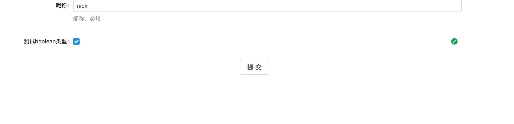

# react-schema-form-antd

通过[json-schema](http://jsonschema.net/),[ui-schema](#custoization-ui-schema),以及[antd](https://ant.design/index-cn)自动生成表单组件。前后端可以复用一份JsonSchema来验证字段，错误消息前后端统一，这个可以有。

[点击这里查看demo](https://nick121212.github.io/fx-schema-form/packages/fx-schema-form-antd/out/index.html#/array)

> Note: 组件之间的功能组合使用hoc来实现。

## 目录

- [安装](#installation)
    - [npm](#installation-npm)
    - [cdn](#installation-cdn)
- [依赖项](#dependencies)
- [默认使用](#usage)
- [表单定制化](#custoization)
    - [uiSchema配置](#custoization-ui-schema)
    - [供选择的表单组件](#custoization-widget)
        - [input](#custoization-widget-input)
        - [select](#custoization-widget-select)
        - [number](#custoization-widget-number)
        - [redio](#custoization-widget-redio)
    - [模板](#custoization-temps)
    - [HOCS](#custoization-hocs)
    - [字段](#custoization-fields)
- [高级配置](#advanced-customization)
    - [自定义hoc](#advanced-customization-hoc)
    - [自定义字段](#advanced-customization-field)
    - [自定义模板](#advanced-customization-temp)
    - [自定义组件](#advanced-customization-widget)
- [验证](#validation)
    - [本地验证](validation-local)
    - [远程验证](validation-remote)
- [关于JsonSchema](#about-json-schema)
- [License](#license)

## <span id="installation">安装</span>

Requires React 15.0.0+.
> Note: 当前使用*tsc -d*来编译，代码为es6代码;
>

### <span id="installation-npm">通过npm来安装</span>

``` 
$ npm install fx-schema-form-antd --save
```
> Note: 当前组件库默认使用了antd的样式，你也可以使用其他样式来代替。

### <span id="installation-cdn">cdn</span>

> Note: 暂时没有cdn。

## <span id="dependencies">依赖项</span>

- JsonSchema
- antd
- redux
- higher order component
- react-redux
- recompose
- react-act
- avj
- json-pointer

## <span id="usage">默认使用</span>

``` jsx
import React from "react";
import ReactDom from "react-dom";
import { Card, Button, Form } from "antd";
import { createStore, combineReducers } from "redux";
import { Provider } from "react-redux";

import { SchemaForm, createForms, hocFactory, defaultTheme } from "./index";

const schema = {
    type: "object",
    title: "测试SCHEMA",
    required: [ "name"],
    removeAdditional: true,
    properties: {
        name: { 
            type: "string", 
            title: "昵称", 
            default: "nora", 
            description: "昵称，必填" 
        }
    }
};

let uiSchema: any = ["name"];

const globalOptions = {
    "ui:temp": ["formItem"]
};
let reducer = createForms.createOne("test", {
    name: "nick"
});

let store = createStore<any>(combineReducers({
    test: reducer.reducer
}));

store.subscribe(() => {
    console.log(store.getState());
});

ReactDom.render(
    <Provider store={store}>
        <SchemaForm schemaKey={"test"} schema={schema} RootComponent={Form} uiSchema={uiSchema} globalOptions={globalOptions}>
            <Form.Item labelCol={{ xs: 6, offset: 12 }} wrapperCol={{ xs: 6, offset: 12 }}>
                <Button onClick={() => {
                    reducer.actions.validateAllField.bind(reducer)();

                    if (store.getState().test.meta.data.isValid) {
                        alert("提交表单");
                    }

                }}>提交</Button>
            </Form.Item>
        </SchemaForm>
    </Provider>
    , document.getElementById("root"), console.log);
```
如果配置正确，会看到如下图效果：


## <span id="custoization">表单定制化</span>

> Note: JsonSchema用于定义数据结构以及验证规则;
> 而表单的展现形式需要手动配置；

### <span id="custoization-ui-schema">uiSchema配置</span>

JsonSchema
``` jsx
const schema = {
    type: "object",
    title: "测试SCHEMA",
    required: [ "geo"],
    removeAdditional: true,
    properties: {
        name: { type: "string", "title": "昵称", "default": "nora", description: "昵称，必填" },
        number: { type: "number", "title": "测试number类型" },
        integer: { type: "integer", "title": "测试integer类型" },
        boolean: { type: "boolean", "title": "测试boolean类型", default: true },
        array: { type: "array", items: { type: "string", "title": "测试array类型ITEM", minLength: 3 }, "title": "测试array类型" },
        object: {
            type: "object",
            title: "测试对象的生成",
            default: {},
            properties: {
                settings: {
                    type: "boolean",
                    title: "测试boolean类型",
                    default: true
                }
            }
        },
        array1: {
            type: "array",
            title: "测试无限极数组类型",
            items: {
                type: "object",
                required: ["test"],
                properties: {
                    test: { type: "string", title: "无限极测试数据", minLength: 3 },
                    children: { $ref: "test#/properties/array1" }
                }
            }
        },
        null: { type: "null", "title": "测试null类型" },
        muti: { type: ["string", "integer", "number"], "title": "测试多类型" },
        geo: {
            type: "object",
            title: "geo position",
            required: ["lou", "lat"],
            properties: {
                lou: {
                    type: "number",
                    minimum: 0,
                    maximum: 100,
                    title: "纬度"
                },
                lat: {
                    type: "number",
                    title: "经度"
                }
            }
        },
    }
};
```

UiSchema
``` jsx
let uiSchema = ["name", "array", {
     "key": "array1",
     "items": [{ key: "array1/-/test" }, { key: "array1/-/children" }]
 }];
```

- 默认字段
    - key:string            用于确定是哪个字段，格式为 */*形式(例如: name; array1/-/test)，这里的\-代表数组的索引;
    - field:string          用于自定义field组件
    - theme:string          用于自定义的样式
    - widget:string         用于自定义组件
    - items:Array           用于显示子元素
    - ui:temp:Array         用于定义模板
    - ui:item.hoc:Array     用于自定义hoc
    - options:Object        设置项
        - hoc:Object        设置hoc的参数项
        - widget:Object     设置widget的参数，这里的widget需要替换成具体的widget的名称
        - temp:Object       设置模板的配置参数，这里的temp需要替换成具体的temp的名称，可以有多个

> Note: 如果直接设置成string类型，自动转换成{key:string}格式。

## <span id="custoization-widget">供选择的表单组件</span>

widget字段最终的展现形式。一个字段一般可以由多个widget来表现。比如一个string字段，可以使用text，textarea，select，radio等来表现，这个取决于个人喜好。

> Note: 组件可以自行添加。
### <span id="custoization-widget-input">input</span>
用于显示文本的组件
### <span id="custoization-widget-select">select</span>
用于下拉展示的组件
### <span id="custoization-widget-number">number</span>
用于显示数字的组件
### <span id="custoization-widget-redio">redio</span>
用户展示单选组的组件
## <span id="custoization-temps">模板</span>
模板是包装widget的组件，可以使用多个模板来包装。

- 默认模板
    - card      antd中的Card组件
    - col       antd中的col组件
    - formitem  antd中的FormItem组件
    - row       antd中的Row组件

> Note: 模板之间的组合取决于样式库的组件，比如antd中，默认使用FormItem来包装widget。当然也可以使用Card，Row，Col等容器组件。这里FormItem包装了错误信息的显示，你也可以自定一个组件来显示错误信息。数组类型的字段使用默认使用三个模板["row", "col", "card"]
## <span id="custoization-hocs">HOCS</span>

[HOC](https://gist.github.com/sebmarkbage/ef0bf1f338a7182b6775)用于包装组件，相当于一个装饰器模式；

### 默认的hoc

- SchemaForm组件：
    - merge     用于合并JsonSchema和UiSchema。
        1. 使用参数：
            - schema 
            - uiSchema
            - schemaKey
            - schemaFormOptions
        2. 注入属性：
            - mergeSchemaList       合并JsonSchema和UiSchema后的数组，SchemaForm遍历这个数组来生成SchemaFormItem组件。
            - schemaFormOptions     合并数据时产生的中间数据。
- SchemaFormItem组件：
    - make      用于包装hoc的hoc；这里获取uiSchema中ui:item.hoc:Array字段的值，来动态包装hoc。
        1. 注入属性：
            - getHocOptions     获取字段的配置参数的方法。
    - array     用于处理数组类型的hoc。
        1. 注入属性：
            - arrayItems                数组中的操作按钮，添加，显示/隐藏等。
            - createItemChildButtons    数组子元素的操作按钮，删除，上下排序等。
    - field     用于判断当前字段的Field组件和Widget组件。
        1. 使用参数：
            - currentTheme      当前的样式；通过ThemeHoc注入；
            - mergeSchema       合并后的字段配置；通过SchemaForm调用SchemaFormItem后注入
        2. 注入属性：
            - FieldComponent    Field组件
            - WidgetComponent   Widget组件
    - temp      用于创建模板的hoc，使用UiSchema中的ui:temp字段。
        1. 注入属性：
            - uiSchemaOptions 当前字段UiSchema中的的options配置
            - globalOptions   全局参数到temp
            - tempKey         模板的名称到temp  
    - theme     用于调用当前使用的样式，使用UiSchema中的theme字段。
        1. 注入属性：
            - currentTheme    当前使用的样式。  
    - validate  用于验证字段的合法性，传递validate方法到组件。
        1. 输入属性：
            - validate        验证方法。
            - updateItemData  更新值方法。

- 组件使用hoc情况
    - SchemaForm
        - merge     
    - SchemaFormItem
        - make  

> Note: SchemaFormItem中使用make来动态包装Hoc;这里的Hoc顺序：ThemeHoc -> FieldHoc -> ValidateHoc -> ArrayHoc -> TempHoc；这个顺序不能改变，但是每个hoc之间可以插入新的hoc。

## <span id="custoization-fields">字段</span>

字段组件用于确定如何来显示子组件。可以同时设置uiSchema中的field值来指定。默认使用JsonSchema中的type来确定使用的字段类型。

- 默认字段
    - array     显示数组类型的字段；遍历数组元素，嵌套一层SchemaForm，并且传递arrayIndex数组索引字段。
    - normal    显示普通类型的字段；直接展示widget组件
    - object    显示对象类型的字段；嵌套一层SchemaForm

## <span id="advanced-customization">高级配置</span>

### <span id="advanced-customization-hoc">自定义hoc</span>

如果默认的hoc功能不够用，可以自定义hoc来扩展SchemaFormItem组件。
比如需要一个显示/隐藏的功能：

``` jsx

import React from "react";
import { compose } from "recompose";
import { BaseFactory } from "fx-schema-form-core";
import jpp from "json-pointer";

import { ThemeHocOutProps } from "./theme";
import { MakeHocOutProps } from "./make";
import { RC } from "../../types";
import { SchemaFormItemBaseProps } from "../../components/formitem/props";
import { ValidateHocOutProps } from "./validate";
import { mapMetaStateToProps } from "../select";

export interface ConditionHocOutProps {

}

export interface ConditionSettings {
    fields: Array<{
        key: string,
        val: any
    }>;
}

/**
 * condition hoc
 * 用于组件的显示隐藏
 *  1. 根据hoc设置中的condition字段来配置显示/隐藏的时机
 *  2. 从formData中获取所需的值，与设置的值做对比，如果都匹配，则显示，否则隐藏
 * @param hocFactory  hoc的工厂方法
 * @param Component 需要包装的组件
 */
export const ConditionHoc = (hocFactory: BaseFactory<any>, Component: any): RC<SchemaFormItemBaseProps & MakeHocOutProps, any> => {
    class Hoc extends React.Component<SchemaFormItemBaseProps & MakeHocOutProps, any> {
        private fieldKey = "ui:condition";

        /**
         * render
         */
        public render(): JSX.Element {
            const { getHocOptions, formData, formDefaultData } = this.props;
            const hocOptions = getHocOptions();
            const { condition: conditionHocOptions } = hocOptions;
            const { fields } = conditionHocOptions as ConditionSettings;
            let isShow = true, jFormData = jpp(Object.assign({}, formDefaultData, formData));

            if (fields && fields.length) {
                isShow = fields.reduce((prev: boolean, { key, val }) => {
                    if (!jFormData.has(key)) {
                        return prev && false;
                    } else {
                        let data = jFormData.get(key);

                        return prev && (data === val);
                    }
                }, isShow);
            }

            if (!isShow) {
                return null;
            }

            return <Component {...this.props} />;
        }
    }

    return Hoc;
};

hocFactory.add("condition",ConditionHoc);
```

设置uiScham的值，当object/settings的值为true的时候，显示name字段；

``` json
[{
    "key": "name",
    "ui:item.hoc": ["theme", "field", "validate", "array", "condition", "temp"],
    "options": {
        "hoc": {
            "condition": {
                "fields": [{ "key": "/object/settings", "val": true }]
            }
        }
    }
}, "object/settings"];
```



### <span id="advanced-customization-field">自定义字段</span>
### <span id="advanced-customization-temp">自定义模板</span>
### <span id="advanced-customization-widget">自定义组件</span>


## <span id="license">License</span>

Apache 2