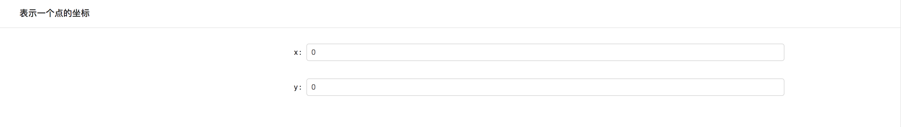

# react-schema-form

爬虫前端核心组件。

## [DEMO](https://nick121212.github.io/fx-schema-form/packages/fx-schema-form-extension/dist/index.html)

## react-schema-form-react V3

通过[json-schema](http://jsonschema.net/),[ui-schema](#custoization-ui-schema),自动生成表单组件。前后端可以复用一份JsonSchema来验证字段，错误消息前后端统一，这个可以有。

> Note: 组件之间的功能组合使用hoc来实现。

## 目录

- [安装](#安装)
  - [npm](#npm)
- [依赖项](#依赖项)
- [性能](#性能)
- [默认使用](#默认使用)
  - [实例化ajv](实例化ajv)
  - [创建store，初始化schemaform的reducer](创建store，初始化schemaform的reducer)
  - [将schemaform的actions添加到store](将schemaform的actions添加到store)
  - [加入template和widget](加入template和widget)
  - [实例化SchemaForm组件](实例化SchemaForm组件)
- [表单定制化](#表单定制化)
  - [全局配置参数](#全局配置参数)
  - [UiSchema配置](#UiSchema配置)
  - [模板](#模板)
  - [HOCS](#HOCS)
  - [字段](#字段)
- [高级配置](#高级配置)
  - [自定义hoc](#自定义hoc)
  - [自定义字段](#自定义字段)
  - [自定义模板](#自定义模板)
  - [自定义组件](#自定义组件)
- [验证](#验证)
  - [本地验证](本地验证)
  - [远程验证](远程验证)
- [License](#license)

## 安装

### npm

``` nodejs
npm install --save fx-schema-form-react
```

## 依赖项

- react
- redux
- react-redux
- immutable
- recompose
- ajv
- reselect
- redux-act
- resolve-pathname
- redux-immutable

> Note: 请根据自己的项目情况选择使用。

## 性能

这里。更改一下数据，触发错误信息；以下是Schema和图片：

``` json

{
    "type": "array",
    "items": {
        "type": "object",
        "properties": {
            "name": { "type": "string", "minLength": 10 },
            "password": { "type": "string" }
        }
    }
}

```


## 默认使用

导入fx-schema-form-react的依赖

```tsx
import schemaFormReact from "fx-schema-form-react";

const { reducerFactory, schemaFormDec, hocFactory, defaultTheme } = schemaFormReact;
```

### 实例化ajv

[详细的配置请查看ajv的官网文档。](http://epoberezkin.github.io/ajv/#options)

```tsx
 const curAjv: ajv.Ajv = new ajv({
    allErrors: true,
    jsonPointers: true,
    useDefaults: true,
    $data: true,
    errorDataPath: "property",
    removeAdditional: true,
});
```

### 创建store，初始化schemaform的reducer

这里的reducer的key是可以自定义的。从工厂类中获取schemaForm这个类；schemaForm是默认定义的reducer，可以自定义reducer来覆盖；

```tsx
let store = createStore<any>(combineReducers({
    "schemaForm": reducerFactory.get("schemaForm").reducer as any
}), Immutable.fromJS({}));
```

### 将schemaform的actions添加到store

这里的actions注册到store就可以直接使用，不需要在使用dispatch来触发action。

```tsx
let actions = reducerFactory.get("schemaForm").actions;
for (const key in actions) {
    if (actions.hasOwnProperty(key)) {
        const element = actions[key];
        element.assignTo(store);
    }
}
```

### 加入template和widget

默认没有[template](自定义模板)和[widget](自定义组件)，需要加入一些组件。

```jsx
defaultTheme.tempFactory.add("default", NoneTemp as any);
defaultTheme.tempFactory.add("card", AntdCardTemp as any);
defaultTheme.tempFactory.add("formitem", AntdFormItemTemp as any);

defaultTheme.widgetFactory.add("checkbox", AntdCheckboxWidget as any);
defaultTheme.widgetFactory.add("default", AntdInputWidget as any);
defaultTheme.widgetFactory.add("number", AntdInputNumberWidget as any);

```

### 创建表单组件

```jsx
/**
 * SchemaForm的Hoc
 * 加入了
 * data           当前表单的数据，实时更新。
 * root           当前表单的meta根节点。
 * isValid        当前表单验证是否正确。
 * isValidating   当前表单是否正在验证。
 * errors         当前表单的所有错误信息。
 */
@(schemaFormDec({
    rootReducerKey: ["schemaForm"],
    parentKeys: ["designForm"]
}) as any)
class TestForm extends React.PureComponent<any> {
    private _validateAll: () => Promise<void>;
    constructor(props: any) {
        super(props);
        /**
         * 创建一个form的数据，key为form的数据根路径；data是form的默认数据。
         */
        actions.createForm({
            key: "designForm",
            data: {
                dsModelIds: [],
                name: "nick"
            }
        });
        this._validateAll = props.validateAll.bind(this);
    }

    /**
     * @param RootComponent     使用Form来创建根元素
     * @param schemaId          schema的id是design
     * @param uiSchemas         需要渲染的表单元素
     * @param uiSchema          父亲uiSchema
     * @param parentKeys        数据节点的根Keys，一般就等于crateForm中的key
     * @param globalOptions     全局的配置
     * @param ajv               ajv的实例
     */
    public render() {
        return (<div>
            <SchemaForm
                key={"designForm" + "design"}
                RootComponent={Form}
                schemaId="design"
                uiSchemas={["*"]}
                uiSchema={null as any}
                parentKeys={this.props.parentKeys}
                globalOptions={gloabelOptions}
                ajv={curAjv} />
            <Button key={"submit"} type="primary" onClick={this.props.validateAll} loading={this.props.isValidating}>提交表单</Button>
        </div>);
    }
}
```

### 实例化SchemaForm组件

```jsx
ReactDOM.render(
  <Provider store={store}>
      <div>
          <TestForm ajv={curAjv} schemaId="design" />
          {/*<ReactPerfTool perf={Perf} />*/}
      </div>
  </Provider>,
  document.getElementById("root"),
  () => {
      console.log("form ok!");
  });
```

## 表单定制化

### 全局配置参数

默认分为3块内容：

- field: 所有的field的参数配置在此;
- temp: 所有的模板的参数配置在此;
- hoc: 所有的hoc的参数配置在此;

``` jsx
const gloabelOptions = Immutable.fromJS({
    field: {
        // 这里定义了field默认的参数
        // 所有的field参数都会默认合并default的配置
        default: {
            temps: ["formitem"],
            widgetHocs: [schemaFormReact.hocFactory.get("data")({
                data: true
            })]
        },
        // 数组字段类型配置
        array: {
            // 定义了包裹的模板
            temps: ["card"],
            // 添加自定义的hoc，来增强功能
            // 为array字段添加sort排序功能使用[react-sortable-hoc]组件地址：
            https://github.com/clauderic/react-sortable-hoc
            // 与【fieldHocs】的区别在于
            // 包裹的位置不同，formHocs是包裹在field组件内部的根元素上；fieldHocs是包裹在field组件上
            formHocs: [(Component: any) => {
                class SortableComponentWrapper extends React.PureComponent<any> {
                    private _onSortEnd: any;

                    constructor(props: any) {
                        super(props);
                        this._onSortEnd = this.onSortEnd.bind(this);
                    }

                    private onSortEnd({ oldIndex, newIndex }: { oldIndex: number; newIndex: number; }) {
                        const { uiSchema, parentKeys } = this.props;

                        if (oldIndex === newIndex) {
                            return;
                        }
                        this.props.moveItem(parentKeys, uiSchema.keys, oldIndex, newIndex);
                    }

                    public render() {
                        return <Component useWindowAsScrollContainer={true}
                            pressDelay={300} onSortEnd={this._onSortEnd}  {...this.props} />;
                    }
                }

                return SortableComponentWrapper;
            },
            // react-sortable-hoc 提供的hoc
            SortableContainer],
            // 数组的子元素添加 SortableElement hoc，使得可以排序
            formItemHocs: [SortableElement, shouldUpdate(() => false)],
            // 这个字段包裹在field组件外面，用于获取数组的元素个数
            fieldHocs: [schemaFormReact.hocFactory.get("data")({
                data: true,
                dataLength: true
            })]
        },
        normal: {},
        object: {
            temps: ["card"]
        }
    },
    temp: {
        card: {
            // 包裹外temp组件外部的hoc，用于获取数据
            tempHocs: [schemaFormReact.hocFactory.get("data")({
                meta: true,
                metaKeys: ["errorText", "isValid", "collapsing"]
            }), immutableRenderDecorator],
            // 组件的默认参数，根据不同的组件会有所不同
            options:{}
        },
        formitem: {
            // 包裹外temp组件外部的hoc，用于获取数据
            tempHocs: [schemaFormReact.hocFactory.get("data")({
                meta: true,
                metaKeys: ["isLoading", "errorText", "isValid", "dirty"]
            }), immutableRenderDecorator],
            // 组件的默认参数
            options: {
                labelCol: {
                    xs: { span: 24 },
                    sm: { span: 8 },
                },
                wrapperCol: {
                    xs: { span: 24 },
                    sm: { span: 16 },
                },
            }
        }
    },
    // hoc的默认参数
    hoc: {
        // dataHoc的参数
        data: {
            rootReducerKey: ["schemaForm"]
        },
        // 数组hoc的参数
        array: {
            ArrayComponent: ArrayComponent,
            ArrayItemComponent: ArrayItemComponent
        }
    }
})
```

### UiSchema配置

uiSchema的参数配置：

- **options?: Immutable.Map<string, any>;** 定义参数，与全局的配置参数格式一致；会覆盖全局的配置参数，用于单个FormSchemaItem的配置。
- **children?: Array<UiSchema | string>;** 一般用于object和array的对象；用于渲染下级显示的key。
- **theme?: string;** 主题样式配置（default: default）。
- **field?: string;** 定义字段。默认使用JsonSchema的type来确定field，也可以使用这个来指定字段。
- **widget?: string;** 定义显示组件。每种数据类型都可以使用不同的组件来渲染。
- **temps?: string[];** 定义包裹的模板数组。
- **isRequired?: boolean;** 是否是required，自动添加。
- **readonly?: boolean;** 是否是只读的。
- **hocs?:Array<string | ComponentEnhancer>;** 用于包裹整个ShemaFormItem的hoc数组。(default:["theme", "field", "validate", "array", "temp"])

### 模板

模板是一个用来包裹Widget的组件（例如：Div、Row、Col、Card、FormItem等，其中Card和FormItem需要显示错误信息或者当前状态，所以需要加入hoc来获取数据，这个配置在全局配置中的temp一节）

### HOCS

名称 | 说明 | 依赖 | 加入属性 |
|-  |- |- | - |
[ThemeHoc](#ThemeHoc)    | 解决主题样式| null | currentTheme |
[FieldHoc](#FieldHoc)    | 取得FieldComponent和WidgetComponent | ThemeHoc, UtilsHoc | FieldComponent,WidgetComponent |
[ValidateHoc](#ValidateHoc) | 验证以及数据操作相关 | null | updateItemData,updateItemMeta,validate |
[ArrayHoc](#ArrayHoc)    | 数组的相关操作 | UtilsHoc | addItem,removeItem,moveItem,initArrayComponent,ArrayComponent,ArrayItemComponent |
[TempHoc](#TempHoc)     | 模板的归并 | ThemeHoc, UtilsHoc, [ArrayHoc] | null |
[DataHoc](#DataHoc)     | 用于从reducer中获取数据 | UtilsHoc | [formItemData,formItemMeta,formItemNode] |
[MakeHoc](#MakeHoc)     | 用于FormItem的包裹Hoc合并 | UtilsHoc | null |
[UtilsHoc](#UtilsHoc)    | 工具类Hoc | null | getOptions,getTitle,getPathKeys,normalizeDataPath,getRequiredKeys |
[MergeHoc](#MergeHoc)    | jsonschema和uischema合并 | null | null |

#### ThemeHoc

配置参数: null

返回属性:

- currentTheme: NsFactory 获取当前的主题样式工厂类；

#### FieldHoc

配置参数: null

返回属性:

- FieldComponent: new() => React.PureComponent; 根据schema的配置获取对应的FieldComponent
- WidgetComponent: new() => React.PureComponent; 根据schema的配置来获取对应的WidgetComponent

#### ValidateHoc

配置参数: null

返回属性:

- updateItemData: (props, data, meta?) => void; 提交数据，触发更改数据action
- updateItemMeta: (props, data, meta?, noChange?) => void; 提交meta数据，触发更改meta的action
- validate: (props, data, meta) => any; 验证data的合法性

#### ArrayHoc

配置参数: null

返回属性:

- addItem: (props,data) => Promise; 数组中添加一项到末尾
- removeItem: (parentKeys,keys,index) => void; 数组删除一个元素
- moveItem: (parentKeys,keys,index) => void; 数组中2个元素交换位置
- initArrayComponent: (props,index) => JSX.Element; 根据当前的schema返回ArrayComponent
- ArrayComponent: React.PureComponent; 数组的操作组件
- ArrayItemComponent: React.PureComponent; 数组中子元素的操作组件

#### TempHoc

配置参数:

- tempField: string; 配置中的字段名称
- templates: string[]; 需要使用的temps

返回属性: null

#### DataHoc

配置参数:

- data: boolean; 是否需要数据
- dataLength: boolean; 是否需要数据的长度
- meta: boolean; 是否需要meta数据
- metaKeys: string[]; meta数据中的字段过滤
- treeNode: boolean; 是否需要treeNode

返回属性:

- formItemData: any; 当前组件的数据
- formItemMeta: Immutable.Map; 当前组件的meta数据
- formItemNode: TreeMap; 当前组件对应的tree

#### MakeHoc

配置参数:

- hocs: Array<string|ComponentEnhancer>; 需要compose的hoc数组

返回属性: null

#### UtilsHoc

配置参数: null

返回属性:

- getOptions: (props,category,field,...extraSettings) => Object; 获取当前元素的配置参数
- getTitle: (props,...extraSettings) => string; 获取当前元素的标题
- getPathKeys: (keys,path) => string[]; 获取当前元素keys的相对keys
- normalizeDataPath: (schemaId,dataPath) => string[]; 格式化keys
- getRequiredKeys: (props,include,exclude) => string[]; 获取当前props中所需的prop
- getDefaultData: (ajv,schema,defaultData,merge) => Promise; 获取schema的默认数据

#### MergeHoc

配置参数: null

返回属性:

- mergeSchemaList: FxUiSchema[]; 合并之后的数组

### 字段

字段决定了如何渲染一个数据结构。举个栗子：

```json
{
    "type":"object",
    "title": "表示一个点的坐标",
    "properties":{
        "x":{
            "type":"number"
        },
        "y":{
            "type":"number"
        }
    }
}
```

这里的结构是一个ObjectField对象，所以默认会嵌套一层SchemaForm，然后渲染出x和y的文本框。

如果我想x和y在一行上显示；那这里就要用到自定义的Field，参照自定义Field一节；这里我们自定义一个PointField，在里面直接放入2个文本框，当文本框更改的时候，我们更新相对应的值就可以了，so easy。

***默认字段：***

#### NormalField

普通数据类型字段，直接渲染WidgetComponent。

配置项:

- widgetHocs: Array<string|ComponentEnhancer>; 为WidgetComponent包装hoc

#### ArrayField

根据数组元素的个数，嵌套渲染N个ShemaForm。

配置项:

- formHocs: Array<string|ComponentEnhancer>; 数组根元素包装hocs
- formItemHocs: Array<string|ComponentEnhancer>; 数组中每个元素包装hocs

#### ObjectField

直接嵌套一层SchemaForm。

配置项:

- formHocs: Array<string|ComponentEnhancer>; 为WidgetComponent包装hoc

## 高级配置

> 为了增强功能，很多时候需要自定义一些hoc；

### 自定义hoc

hoc是schema-form的核心功能；比如接口请求，条件判断，数据处理等等。举个例子:

我们需要一个条件判断的功能，比如当a=1的时候，b才显示。具体代码查看[这里](../fx-schema-form-extension/src/hocs/condition.tsx)

### 自定义字段

自定义字段是为了解决一些特殊的数据格式。比如我们有以下数据结构：

```json
{
    "type":"object",
    "$id":"tree",
    "properties":{
        "children":{
            "type":"array",
            "items":{
                "$ref":"tree#"
            }
        }
    }
}
```

这里是一个树形结构，如果我们想渲染成tree。默认的ArrayField显然不能满足需求。具体请[查看源码](../fx-schema-form-extension/src/fields/design.tsx)

### 自定义模板

为了满足不同的样式，不同的需求，需要各种各样的模板组件。

### 自定义组件

为了满足不同的样式组件，这里需要自己建立很多的模组件，比如(input,select,mension...);

## 验证

### 本地验证

本地验证，直接使用json-schema的各种关键字来定义。

当然也可以自定义一些验证，关于自定义验证请查看[这里](http://epoberezkin.github.io/ajv/#api-addkeyword)

### 远程验证

ajv默认支持远程验证，文档在[这里](http://epoberezkin.github.io/ajv/#asynchronous-validation)

## License

[MIT](LICENSE.md)
